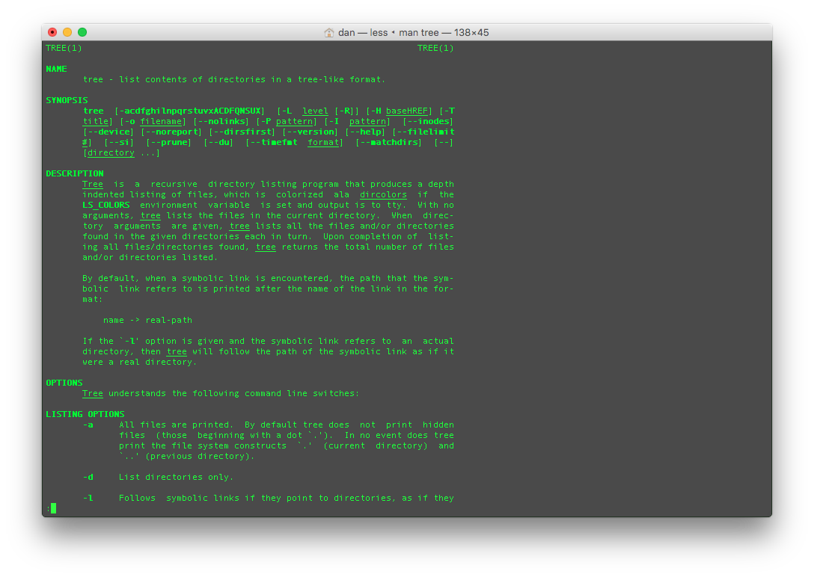
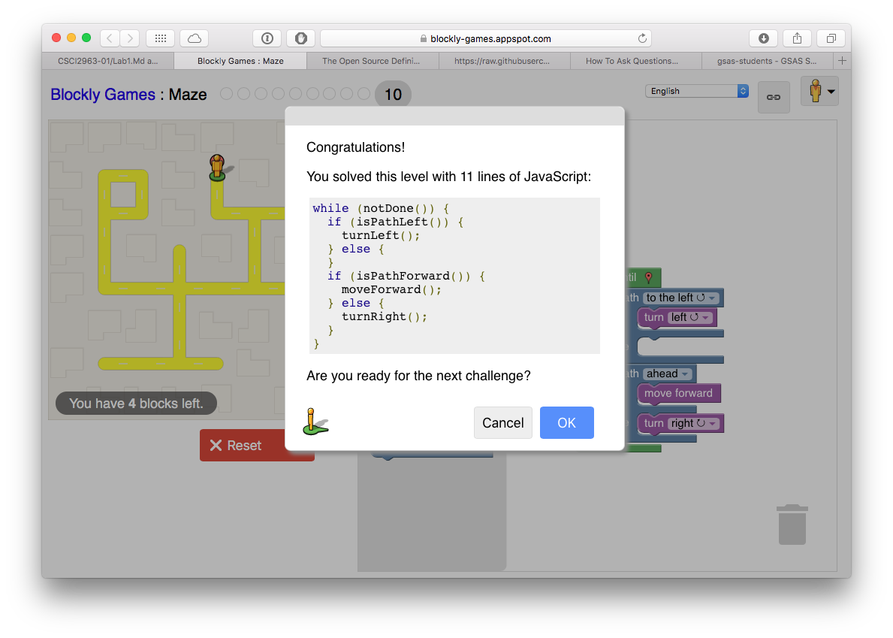
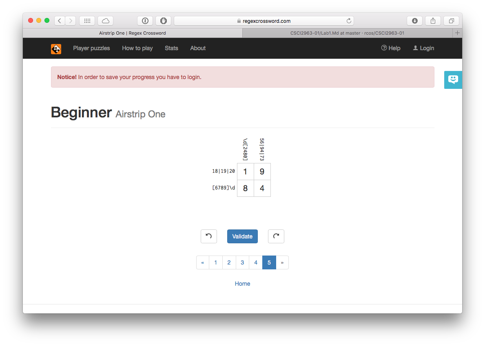

#How to ask good questions
1. Use as much detail as possible, explain your problem and show all the relevant code. Even include some code that you dont think is relevant but make sure to specify where you belive the relevant parts are. Alway copy and paste error messages as well

2. Keep researching you problem after you ask the question. you may find the solution elsewhere. if you find the solution elsewhere, make sure to post it wherever you asked your question.

#Tree Man Page: 

#Blockly Solution: 

#Regular Expressions Tutorial: 

#RegexCrossword: 
